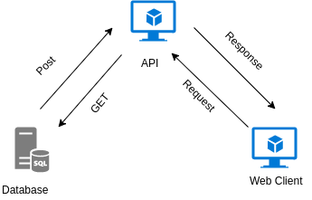

# Marketprint

Marketprint adalah Aplikasi yang menhubungkan antara pelaku usaha percetakan print dengan pembeli (C2C) Secara realtime cloud printing platform. Aplikasi ini dibangun menggunakan bahasa PHP dengan framework laravel 5.4

<p align="center"></p>

<p align="center">
<a href="https://travis-ci.org/laravel/framework"></a>
<a href="https://packagist.org/packages/laravel/framework"></a>
<a href="https://packagist.org/packages/laravel/framework"></a>
<a href="https://packagist.org/packages/laravel/framework"></a>
</p>

# Arsitektur Aplikasi

<p align="center">
	
</p>

## Instalasi

- download project ini pada tombol hijau yang berada disebalah kanan

- download <a href="https://getcomposer.org/download/" target="_blank" title="">composer</a>

- import database lalu sesuaikan pada file .env di folder api

```
DB_DATABASE=api_marketprint
DB_USERNAME=root
DB_PASSWORD=
```

- masuk ke folder web lalu jalankan perintah diterminal 

```
composer install

php artisan serve
```
- masuk ke folder api lalu jalankan perintah diterminal

```
composer install

php artisan serve --port=8001
```